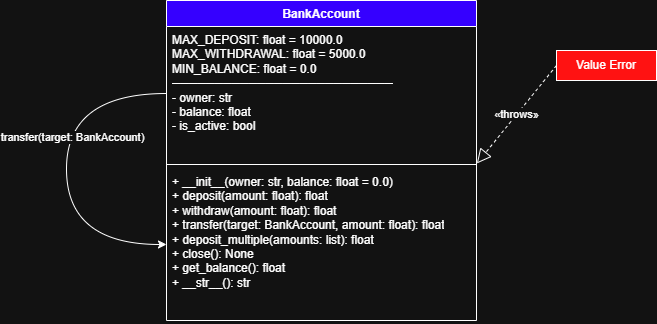
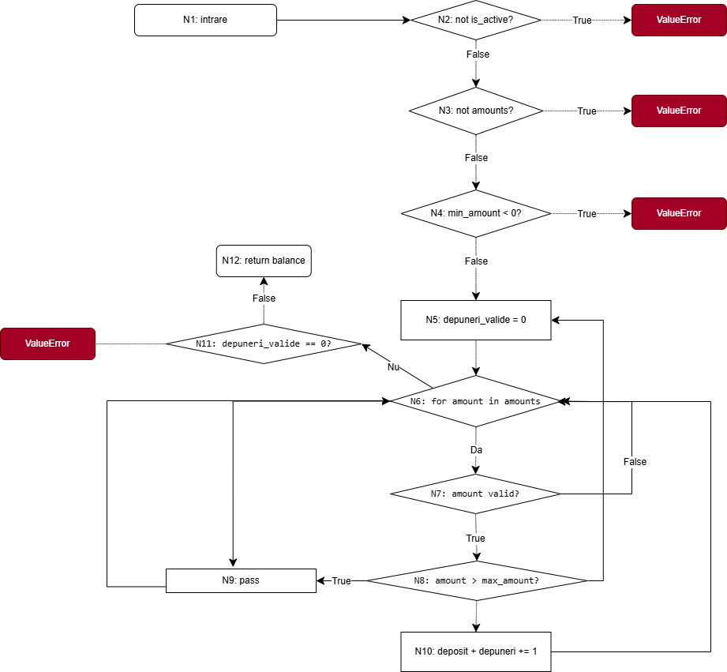
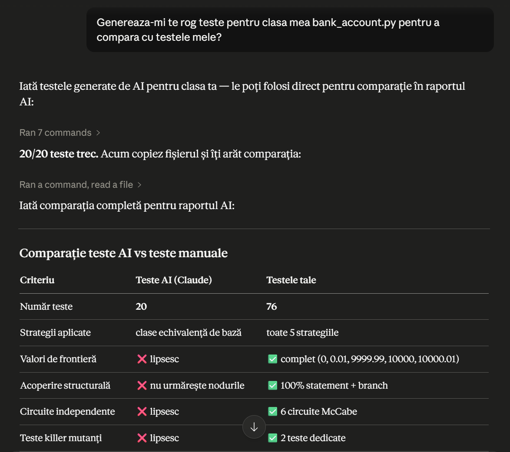
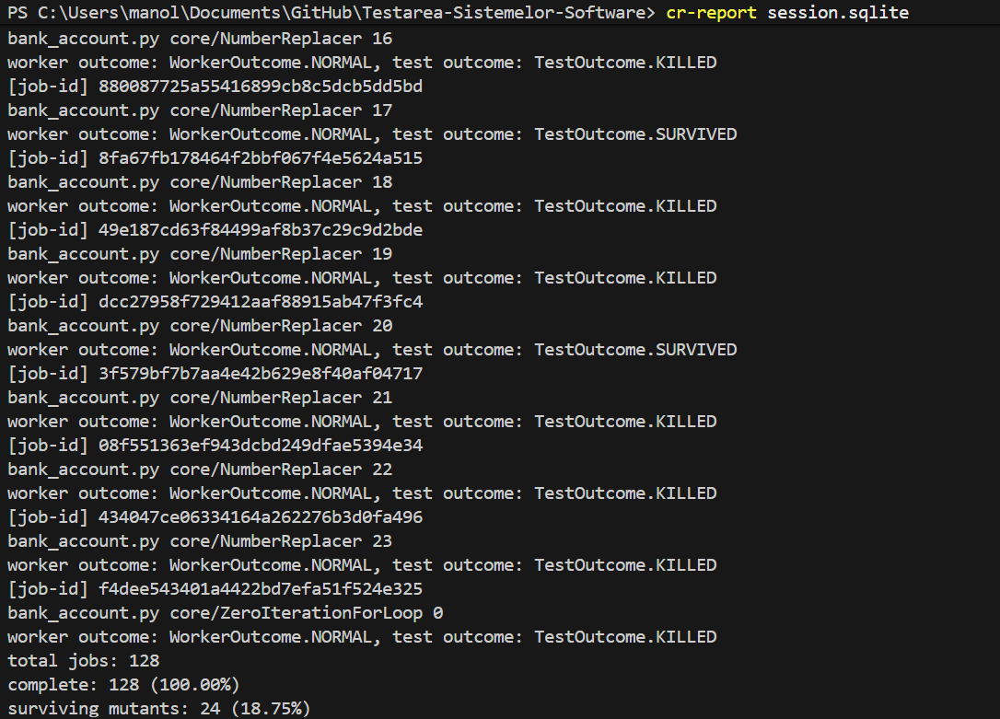
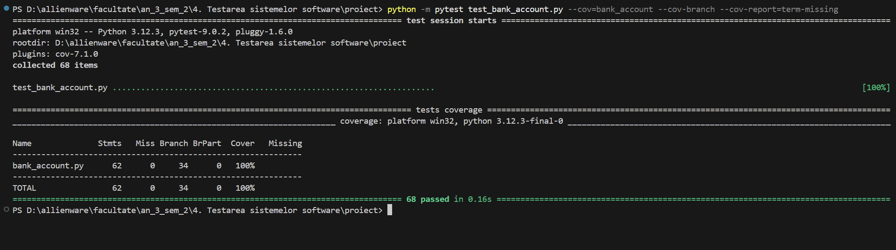
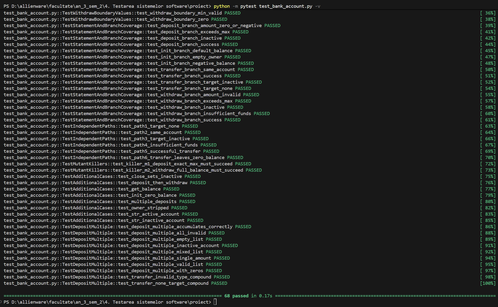

# Proiect Constantin Marius-Cristian, anul III, INFORMATICA-ID 
# T1 – Testare Unitară în Python: `BankAccount`
# T1 – Testare Unitară în Python: `BankAccount`

## Descriere

Acest proiect demonstrează strategiile de testare unitară prezentate la cursul de Testarea Sistemelor Software, aplicate pe clasa `BankAccount` — o implementare simplă a unui cont bancar cu operații de depunere, retragere și transfer.

Funcția principală analizată este `deposit_multiple(amounts, min_amount, max_amount)`, care ilustrează atât testarea funcțională cât și cea structurală.

**Framework de testare:** `unittest` (Python standard library) + `pytest`
**Tool coverage:** `pytest-cov`
**Tool mutanți:** `cosmic-ray`

---

## Structura proiectului

```
T1_Testare_Unitara/
├── bank_account.py         # Clasa testată
├── test_bank_account.py    # Suite de teste (76 teste)
├── cosmic-ray.toml         # Configurație testare prin mutanți
├── README.md               # Documentație (acest fișier)
└── imagini/
    ├── diagrama_clase.png
    ├── graf_flux.png
    ├── rulare_teste.png
    ├── coverage_report.png
    └── mutanti_raport.png
```

---

## Clasa `BankAccount`

### Atribute

| Atribut | Tip | Descriere |
|---|---|---|
| `owner` | `str` | Numele titularului |
| `balance` | `float` | Soldul curent |
| `is_active` | `bool` | Starea contului |
| `MAX_DEPOSIT` | `float` | Limita maximă depunere: 10000.0 |
| `MAX_WITHDRAWAL` | `float` | Limita maximă retragere: 5000.0 |

### Metode

| Metodă | Parametri | Return | Excepții |
|---|---|---|---|
| `__init__(owner, initial_balance=0.0)` | owner: str, balance: float | — | ValueError |
| `deposit(amount)` | amount: float | float | ValueError |
| `withdraw(amount)` | amount: float | float | ValueError |
| `transfer(target, amount)` | target: BankAccount, amount: float | float | ValueError |
| `deposit_multiple(amounts, min_amount, max_amount)` | amounts: list, min_amount: float, max_amount: float | float | ValueError |
| `close()` | — | None | — |
| `get_balance()` | — | float | — |

### Diagrama clasei



---

## Elemente de programare acoperite

| Element | Locație în cod |
|---|---|
| `if` fără `else` | Validările din `deposit()`, `withdraw()`, `transfer()`, `deposit_multiple()` |
| `if` cu `else` | `deposit_multiple()` — verificare `max_amount` și `__str__()` |
| Condiție simplă | `if not self.is_active`, `if not amounts`, `if min_amount < 0` |
| Condiție compusă cu `and` | `deposit_multiple()` — `if amount is not None and amount > min_amount` |
| Condiție compusă cu `or` | `transfer()` — `if target is None or not isinstance(target, BankAccount)` |
| Instrucțiune repetitivă (`for`) | `deposit_multiple()` — `for amount in amounts` |

---

## Testare funcțională pentru `deposit_multiple`

### Specificație

Funcția `deposit_multiple(amounts, min_amount=0.0, max_amount=None)` depune succesiv într-un cont bancar activ sumele din lista `amounts` care satisfac condițiile:
- suma nu este `None`
- suma este strict mai mare decât `min_amount` (implicit 0.0)
- dacă `max_amount` este specificat, suma nu depășește `max_amount`

Dacă nicio sumă din listă nu este validă sau lista este goală, se aruncă `ValueError`.

**Precondiții:**
- contul este activ (`is_active = True`)
- `amounts` este o listă nevoidă
- `min_amount >= 0`

**Postcondiții:**
- soldul contului crește cu suma depunerilor valide
- se returnează noul sold

---

### 1. Partiționare în clase de echivalență

Parametrii funcției și clasele lor:

**`amounts` (lista de sume):**

| Clasă | Mulțime | Tip |
|---|---|---|
| A1 | { amounts \| toate elementele > min_amount și ≤ max_amount } | validă |
| A2 | { amounts \| lista goală: amounts = [] } | invalidă |
| A3 | { amounts \| toate elementele ≤ min_amount sau None } | invalidă |
| A4 | { amounts \| amestec de elemente valide și invalide } | parțial validă |

**`min_amount`:**

| Clasă | Mulțime | Tip |
|---|---|---|
| M1 | { min_amount \| min_amount ≥ 0 } | validă |
| M2 | { min_amount \| min_amount < 0 } | invalidă |

**`max_amount`:**

| Clasă | Mulțime | Tip |
|---|---|---|
| X1 | { max_amount \| max_amount = None } | validă (fără limită superioară) |
| X2 | { max_amount \| max_amount > min_amount } | validă |

**Starea contului:**

| Clasă | Mulțime | Tip |
|---|---|---|
| S1 | { cont \| is_active = True } | validă |
| S2 | { cont \| is_active = False } | invalidă |

**Clase globale** (combinații relevante):

| Clasă globală | Mulțime | Reprezentant ales |
|---|---|---|
| CG1 | { (amounts, min, max, cont) \| A1, M1, X1, S1 } | ([100, 200, 300], 0.0, None, activ) |
| CG2 | { (amounts, min, max, cont) \| A2, M1, X1, S1 } | ([], 0.0, None, activ) → ValueError |
| CG3 | { (amounts, min, max, cont) \| A3, M1, X1, S1 } | ([-100, None], 0.0, None, activ) → ValueError |
| CG4 | { (amounts, min, max, cont) \| A4, M1, X1, S1 } | ([100, -50, None, 200], 0.0, None, activ) |
| CG5 | { (amounts, min, max, cont) \| A1, M2, X1, S1 } | ([100], -1.0, None, activ) → ValueError |
| CG6 | { (amounts, min, max, cont) \| A1, M1, X2, S1 } | ([100, 500, 200], 0.0, 300.0, activ) |
| CG7 | { (amounts, min, max, cont) \| A1, M1, X1, S2 } | ([100], 0.0, None, inactiv) → ValueError |

---

### 2. Analiza valorilor de frontieră

**Frontiere pentru `amount` față de `min_amount` (implicit 0.0):**

| Mulțime | Margine | Valoare testată | Rezultat așteptat |
|---|---|---|---|
| A_invalidă | max al invalidelor | amount = min_amount = 0.0 | sărit (conditie strict >) |
| A_validă | min al validelor | amount = min_amount + 0.01 = 0.01 | depus |
| A_validă | max al validelor (fără max_amount) | amount = 10000.0 (MAX_DEPOSIT) | depus |
| A_invalidă | min al invalidelor peste max | amount = MAX_DEPOSIT + 0.01 | ValueError din deposit() |

**Frontiere pentru `amount` față de `max_amount` (ex: 300.0):**

| Mulțime | Margine | Valoare testată | Rezultat așteptat |
|---|---|---|---|
| A_validă | max al validelor | amount = max_amount = 300.0 | depus (limită inclusivă) |
| A_invalidă | min al invalidelor | amount = max_amount + 0.01 = 300.01 | sărit |

**Frontiere pentru `min_amount`:**

| Mulțime | Margine | Valoare testată | Rezultat așteptat |
|---|---|---|---|
| M_invalidă | max al invalidelor | min_amount = -0.01 | ValueError |
| M_validă | min al validelor | min_amount = 0.0 | succes |

---

## Testare structurală pentru `deposit_multiple`

### Numerotarea instrucțiunilor

```
1   def deposit_multiple(self, amounts, min_amount=0.0, max_amount=None):
2       if not self.is_active:
3           raise ValueError("Contul este inactiv.")
4       if not amounts:
5           raise ValueError("Lista de sume nu poate fi goala.")
6       if min_amount < 0:
7           raise ValueError("Suma minima nu poate fi negativa.")
8       depuneri_valide = 0
9       for amount in amounts:
10          if amount is not None and amount > min_amount:
11              if max_amount is not None and amount > max_amount:
12                  pass
13              else:
14                  self.deposit(amount)
15                  depuneri_valide += 1
16      if depuneri_valide == 0:
17          raise ValueError("Nicio suma valida.")
18      return self.balance
```

### Graful de flux de control



### Nodurile grafului

| Nod | Instrucțiuni | Descriere |
|---|---|---|
| N1 | 1 | intrare în funcție |
| N2 | 2-3 | decizie: cont inactiv? |
| N3 | 4-5 | decizie: lista goală? |
| N4 | 6-7 | decizie: min_amount < 0? |
| N5 | 8 | inițializare depuneri_valide = 0 |
| N6 | 9 | condiție buclă for |
| N7 | 10 | decizie: amount valid față de min_amount? |
| N8 | 11 | decizie: amount depășește max_amount? |
| N9 | 12 | pass (suma sărit) |
| N10 | 14-15 | deposit + incrementare contor |
| N11 | 16-17 | decizie: nicio depunere validă? |
| N12 | 18 | return balance |

### Acoperire la nivel de instrucțiune (Statement Coverage)

Fiecare instrucțiune (nod) trebuie parcursă cel puțin o dată:

| Test | Input | Noduri parcurse |
|---|---|---|
| T1 | cont inactiv, [100] | N1→N2→N3 (stop: ValueError) |
| T2 | activ, [] | N1→N2→N3→N4 (stop: ValueError) |
| T3 | activ, [-1], min=0 | N1→N2→N3→N4→N5→N6→N7→N6→N11→N17 |
| T4 | activ, [100, 500], max=300 | N1→...→N6→N7→N8→N9→N6→N7→N8→N10→N6→N11→N12 |
| T5 | activ, [100] | N1→N2→N3→N4→N5→N6→N7→N8→N10→N6→N11→N12 |

### Acoperire la nivel de decizie (Branch Coverage)

Fiecare ramură a fiecărei decizii trebuie parcursă:

| Decizie | Ramura True | Ramura False |
|---|---|---|
| N2: `not is_active` | cont inactiv → ValueError | cont activ → continuă |
| N3: `not amounts` | listă goală → ValueError | listă nevoidă → continuă |
| N4: `min_amount < 0` | min negativ → ValueError | min valid → continuă |
| N6: condiție `for` | mai sunt elemente → N7 | lista epuizată → N11 |
| N7: `amount valid` | amount valid → N8 | amount invalid → N6 |
| N8: `amount > max` | depășește max → N9 | în interval → N10 |
| N11: `depuneri == 0` | nicio depunere → ValueError | cel puțin una → return |

### Acoperire la nivel de condiție (Condition Coverage)

Condiții individuale și valorile lor:

| Condiție compusă | Condiție individuală | True | False |
|---|---|---|---|
| `amount is not None and amount > min_amount` | `amount is not None` | amount = 100 | amount = None |
| `amount is not None and amount > min_amount` | `amount > min_amount` | amount = 100, min = 0 | amount = 0, min = 0 |
| `max_amount is not None and amount > max_amount` | `max_amount is not None` | max = 300 | max = None |
| `max_amount is not None and amount > max_amount` | `amount > max_amount` | amount = 500, max = 300 | amount = 100, max = 300 |

### Circuite independente

Complexitatea ciclomatică: **V(G) = e - n + 2**

Noduri (n): 12, Arce (e): 16 → **V(G) = 16 - 12 + 2 = 6 circuite independente**

| Circuit | Cale | Descriere |
|---|---|---|
| C1 | N1→N2→STOP | cont inactiv |
| C2 | N1→N2→N3→STOP | listă goală |
| C3 | N1→N2→N3→N4→STOP | min_amount negativ |
| C4 | N1→...→N6→N7→N6→N11→STOP | toate sumele invalide |
| C5 | N1→...→N6→N7→N8→N9→N6→N11→N12 | sume peste max_amount |
| C6 | N1→...→N6→N7→N8→N10→N6→N11→N12 | depunere reușită |

---

## Raport testare prin mutanți (cosmic-ray)

**Configurație:**
```toml
[cosmic-ray]
module-path = "bank_account.py"
timeout = 10.0
test-command = "python -m pytest test_bank_account.py -x -q"
```

**Prima rulare** (fără testele killer):
```
total jobs: 128
surviving mutants: 9 (7.03%)
```

Mutanți neechivalenți identificați:

| ID | Locație | Modificare | Efect |
|---|---|---|---|
| M1 | `deposit()` linia 59 | `amount > MAX_DEPOSIT` → `amount >= MAX_DEPOSIT` | depunerea de exact 10000 refuzată greșit |
| M2 | `withdraw()` linia 84 | `amount > self.balance` → `amount >= self.balance` | retragerea soldului integral refuzată greșit |

**A doua rulare** (cu testele killer adăugate):
```
total jobs: 128
surviving mutants: 7 (5.47%)
```


### Analiza mutanților echivalenți rămași

| Mutant | Locație | Modificare | Motiv echivalență |
|---|---|---|---|
| E1: `ReplaceComparisonOperator_Is_Eq` | `transfer()` — `target is self` | `is` → `==` | `__eq__` nedefinit, `is` și `==` identice |
| E2: `ReplaceComparisonOperator_Eq_LtE` | `deposit_multiple()` — `depuneri_valide == 0` | `==` → `<=` | contorul nu poate fi negativ |
| E3-E5: `NumberReplacer` (2,4,5) | `MIN_BALANCE = 0.0` | `0.0` → alt număr | constanta nefolosită în logică |
| E6-E7: `NumberReplacer` (16,18) | `deposit_multiple()` — `depuneri_valide = 0` | `0` → alt număr | contorul nu poate fi negativ |

> **Concluzie:** Toți 7 mutanții rămași sunt echivalenți. Mutation score efectiv: **101/101 = 100%**.

---

## Raport privind folosirea unui tool de AI (Claude)

Pentru această parte a proiectului s-a utilizat tool-ul de inteligență artificială **Claude** [7] în scopul generării unei suite de teste alternative pentru clasa `BankAccount`. Testele autogenerate au fost salvate în fișierul `test_bank_account_ai.py` și au fost comparate cu suita proprie, dezvoltată manual în `test_bank_account.py`.

### Prompt utilizat

Promptul transmis tool-ului AI a fost următorul:

> *„Genereaza-mi te rog teste pentru clasa mea bank_account.py pentru a compara cu testele mele?"*

### Răspuns AI

Pe baza promptului, Claude a generat o suită de 20 de teste unitare organizate în clasa `TestBankAccountAI`, acoperind operațiile principale (`deposit`, `withdraw`, `transfer`, `deposit_multiple`) prin cazuri valide și cazuri care aruncă excepții. Răspunsul complet, împreună cu tabelul de comparație furnizat de tool, este prezentat în captura de mai jos.



### Rularea testelor autogenerate

Testele generate de AI au fost rulate cu `pytest`. Toate cele 20 de teste trec (20/20, 100%) într-un timp de ~0.06s.

```bash
python -m pytest test_bank_account_ai.py -v
```


### Testarea prin mutanți a suitei AI

Pentru o comparație obiectivă a calității, suita autogenerată a fost supusă aceluiași proces de testare prin mutanți (`cosmic-ray`), pe aceeași configurație de 128 de mutanți generați.

```bash
cosmic-ray exec cosmic-ray.toml session.sqlite
cr-report session.sqlite
```

Rezultatul rulării arată o rată de supraviețuire de **18.75%** (24 de mutanți supraviețuitori din 128), semnificativ mai mare decât cea a suitei proprii.



### Comparație suită proprie vs. suită autogenerată

| Criteriu | Teste AI (Claude) | Teste proprii (manuale) |
|---|---|---|
| Număr teste | 20 | 76 |
| Strategii aplicate | clase de echivalență de bază | toate cele 5 strategii |
| Analiza valorilor de frontieră | lipsește | completă (0, 0.01, 9999.99, 10000, 10000.01) |
| Acoperire structurală | nu urmărește nodurile grafului | 100% statement + branch |
| Circuite independente (McCabe) | lipsesc | 6 circuite |
| Teste killer pentru mutanți | lipsesc | 2 teste dedicate |
| Mutanți supraviețuitori | 24 (18.75%) | 7 (5.47%), toți echivalenți |

### Interpretarea diferențelor

Diferențele dintre cele două suite sunt semnificative atât cantitativ, cât și calitativ. Suita autogenerată conține un număr redus de teste (20 față de 76) și se limitează la o partiționare de bază în clase de echivalență, generând câte un caz valid și câteva cazuri de excepție pentru fiecare metodă.

Principala limitare a testelor AI este absența unei strategii structurale: tool-ul nu pornește de la graful de flux de control, deci nu garantează parcurgerea tuturor nodurilor și ramurilor. De asemenea, nu realizează analiza valorilor de frontieră — valorile critice precum `MAX_DEPOSIT` exact, limita inclusivă a parametrului `max_amount` sau pragul `min_amount + 0.01` nu sunt testate. În plus, suita AI nu conține teste killer dedicate pentru mutanții neechivalenți identificați în suita proprie (operatorii `>` față de `>=` din `deposit()` și `withdraw()`).

Aceste limitări se reflectă direct în rezultatul testării prin mutanți: suita AI lasă în viață 24 de mutanți (18.75%), în timp ce suita proprie lasă doar 7 mutanți, toți demonstrați a fi echivalenți. Cu alte cuvinte, testele autogenerate detectează mai puține defecte injectate, ceea ce confirmă că o suită construită sistematic, pe baza tuturor celor cinci strategii de testare, oferă o acoperire net superioară.

### Concluzie

Tool-ul de AI [7] s-a dovedit util pentru generarea rapidă a unui set inițial de teste funcționale de bază, fiind un bun punct de plecare. Totuși, pentru o testare riguroasă — cu acoperire structurală completă, analiză a valorilor de frontieră și uciderea mutanților neechivalenți — intervenția manuală bazată pe strategiile prezentate la curs rămâne indispensabilă.

---

## Configurație hardware și software

### Hardware

| Componentă | Specificație |
|---|---|
| Procesor | Intel Core i9-13900H (13th Gen) |
| Memorie RAM | 32 GB |
| Sistem de operare | Microsoft Windows 11 Home 64-bit |

### Software

| Tool | Versiune | Rol |
|---|---|---|
| Python | 3.12.3 | Limbaj de programare |
| pytest | 9.0.2 | Framework de testare |
| pytest-cov | 7.1.0 | Măsurare acoperire cod |
| pluggy | 1.6.0 | Sistem de plugin-uri pytest |
| cosmic-ray | 8.4.6 | Testare prin mutanți |
| diagrams.net | online | Realizare diagrame |

> Nu s-a utilizat o mașină virtuală. Proiectul a rulat direct pe sistemul de operare nativ.

---

## Rulare

### Instalare dependențe
```bash
pip install pytest pytest-cov cosmic-ray
```

### Rulare teste
```bash
python -m pytest test_bank_account.py -v
```

### Rulare cu coverage
```bash
python -m pytest test_bank_account.py --cov=bank_account --cov-branch --cov-report=term-missing
```



### Rulare testare prin mutanți
```bash
cosmic-ray init cosmic-ray.toml session.sqlite --force
cosmic-ray exec cosmic-ray.toml session.sqlite
cr-report session.sqlite
cr-report session.sqlite --surviving-only
```



---

## Rezultate finale

| Metrică | Valoare |
|---|---|
| Număr total teste | 76 |
| Teste trecute | 76/76 (100%) |
| Timp rulare | ~0.19s |
| Statement coverage | 100% (66 statements) |
| Branch coverage | 100% (38 branches) |
| Mutanți generați | 128 |
| Mutanți eliminați | 121 (94.53%) |
| Mutanți neechivalenți uciși cu teste dedicate | 2 |
| Mutanți supraviețuitori echivalenți | 7 |
| Mutation score efectiv (fără echivalenți) | 100% |

---

## Referințe bibliografice

[1] pytest Documentation, *pytest: helps you write better programs*, https://docs.pytest.org/en/stable/, Data ultimei accesări: 10 mai 2026.

[2] pytest-cov Documentation, *pytest-cov: Coverage plugin for pytest*, https://pytest-cov.readthedocs.io/en/latest/, Data ultimei accesări: 10 mai 2026.

[3] Cosmic Ray Documentation, *Cosmic Ray: Mutation Testing for Python*, https://cosmic-ray.readthedocs.io/en/latest/, Data ultimei accesări: 10 mai 2026.

[4] Python Software Foundation, *unittest — Unit testing framework*, https://docs.python.org/3/library/unittest.html, Data ultimei accesări: 10 mai 2026.

[5] Ammann, P., Offutt, J., *Introduction to Software Testing* (2nd ed.), Cambridge University Press, 2016.

[6] Jia, Y., Harman, M., An Analysis and Survey of the Development of Mutation Testing, IEEE Transactions on Software Engineering, vol. 37, nr. 5, 2011, pp. 649-678.

[7] Claude, https://claude.ai, Data generării: 10 mai 2026 si 25 mai 2026.
